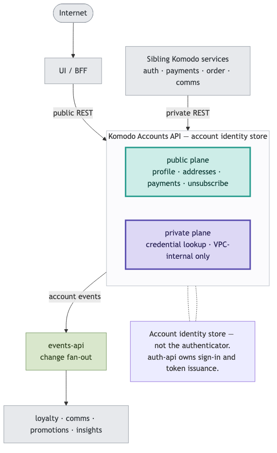
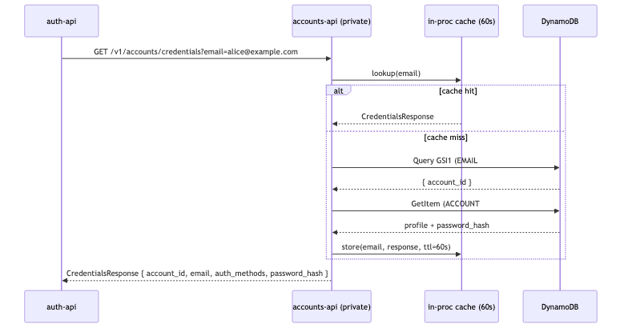
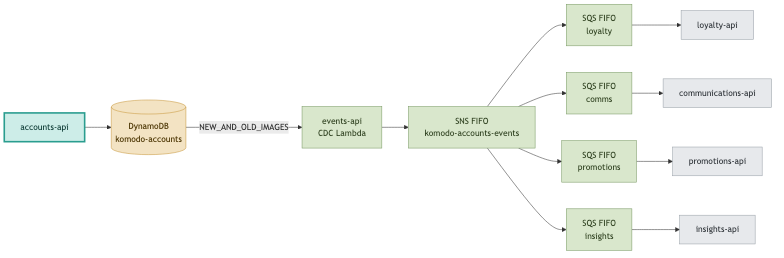
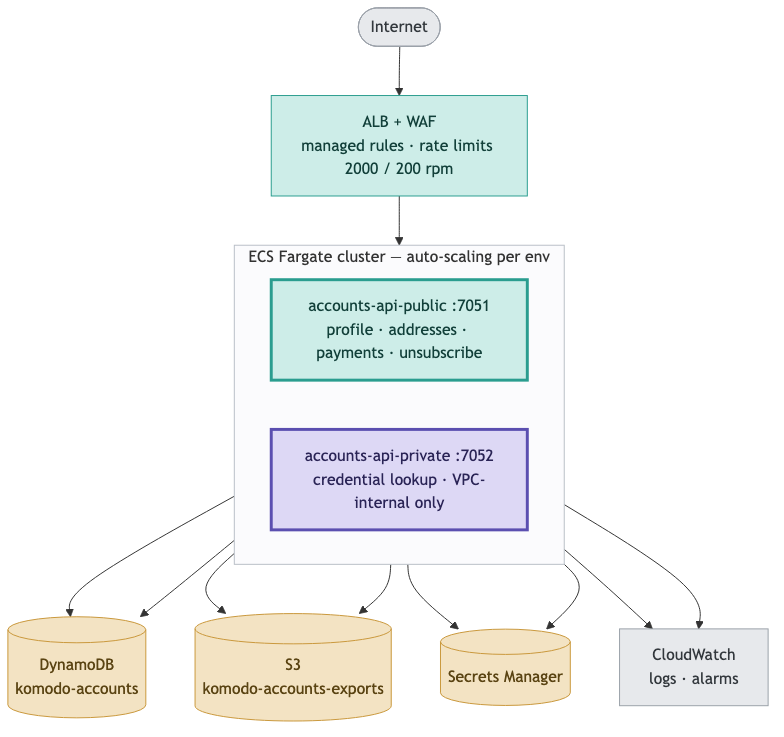

# High-Level Design (HLD) — Komodo Accounts API

## Owners

- **Author(s):** Komodo
- **Status:** In Progress

---

## 1. System Context

**Executive Summary**

Accounts API is the single trusted record of who a Komodo customer is — their profile, saved addresses, saved payment methods, and the credentials that let them sign in without a password. Every customer feels this system directly, whether they notice it or not: a fast sign-in on every visit, a checkout that already knows their address and card, and a deletion request that actually deletes. It also carries real legal weight — this is where Komodo makes good on its privacy commitments under GDPR and equivalent US law, so getting account closure and data export right is regulatory exposure, not a nice-to-have.

### 1.1 Overview

Accounts API is the canonical store for account identity data: profiles, account settings, passkey public keys, preferences, address books, payment-method references, and consent history. It is a data store, not an authenticator — auth-api owns token issuance and credential verification, and every design choice in this service defers to that boundary rather than blurring it.

Both planes are served by the same deployable service — one artifact, two listeners, so the public and private surfaces can never drift apart in version.

| | Public | Private |
|---|---|---|
| Listener | Public listener, internet-facing | Private listener, internal-only |
| Exposure | Reachable from the internet, behind a load balancer and a web application firewall | Reachable only from inside Komodo's private network — sibling services only |
| Callers | The web/app front end, on behalf of a signed-in customer | Sibling Komodo services (auth-api, payments-api, order-api, communications-api) |
| Auth | Customer access token, signature-verified on every request | Service access token, issued through machine-to-machine credential exchange, signature-verified on every request |
| Surface | Profile (including avatar upload), settings, addresses, payments (display-safe view only), preferences, consent, account closure and restore, data export, unsubscribe verification | Credential read/write, passkey lifecycle, full payment-method read (including the processor reference), settings and tag writes, unsubscribe-token issuance, the hard-erase worker |
| Rate limiting | Global and per-route limits, enforced at the network edge and in-process | Trusted callers only; no public-style limiter |

 

**Components:**

| Component | Responsibility |
|---|---|
| Service bootstrap | Loads configuration and secrets, wires dependencies, registers routes, starts both listeners |
| Request-handling layer (per resource) | Translates each incoming request — profile, settings, passkey, address, payment, preferences, consent, export, unsubscribe — into a service-layer call and a response |
| Service / orchestration layer | Enforces business invariants (one default address or payment method, tag-ownership rules), coordinates changes that touch more than one record, and decides when a domain event should fire |
| Data-store adapter | Translates service-layer calls into reads and writes against this service's own database |
| In-process cache | Short-lived in-memory cache in front of the hottest reads (profile, credentials) |
| Shared internal library layer | Common building blocks used across Komodo services: request handling, authentication/authorization middleware, rate limiting, error handling, secrets access, database access, logging, health checks |

### 1.2 Critical Paths

**Credential lookup — the sign-in hot path.** auth-api calls this service on every sign-in attempt to resolve a customer's credentials. A missing account and a lookup failure return distinct, unambiguous signals so auth-api can react correctly to each. The full round trip is budgeted at roughly 100 milliseconds for nearly all requests — every customer feels this number, because it sits directly on the critical path between "enter email" and "you're in."

**Passkey lifecycle — private, auth-api only.** auth-api can list every device-based credential registered to an account, register a new one, update it after a successful sign-in (so the service can detect a compromised or cloned device on the next attempt), and remove one. Only the public half of each credential is ever stored — private key material never reaches this service, by design.

**Profile management.** Customers and sibling services can create, read, and update a profile. Every update is partial: fields left out of a request are left untouched. Creation and update timestamps are stamped automatically. A change to a customer's email is detected and announced as its own event, separately from other profile changes, because email changes trigger their own downstream handling elsewhere in Komodo. Address and payment methods are the one exception to "partial update" — each write replaces the record whole, since they arrive as complete records from the customer or a payment processor rather than as field-by-field edits.

**Avatar upload.** A customer requests a 15-minute, single-use upload link — capped at a small file size and restricted to standard image formats — and uploads their photo directly to storage, without routing the image through this service's own compute. This keeps upload cost and latency off this service's critical path. Storage itself is locked down to private, encrypted, secure-transport-only access; there is no public read path to any stored photo.

**Account closure & right to erasure (US and EU privacy law).** Closure is two-phase: a recoverable window, then an irreversible, complete erasure. This design lets Komodo honor a customer's legal right to be forgotten while still protecting them from an accidental or malicious closure request. It satisfies the erasure guarantees under GDPR and the equivalent body of US state privacy law.

| Step | Trigger | Action |
|---|---|---|
| 1. Request | Customer requests account closure | Account is marked pending deletion; no data is removed yet; an event announces the request; the customer receives immediate confirmation |
| 2. Restore (optional) | Customer restores the account, inside the recoverable window | Account is marked active again; an event announces the cancellation |
| 3. Hard erase | A scheduled process, once the recoverable window has passed | Every piece of data tied to the account — records and stored files alike — is permanently removed in one atomic operation; cached copies are invalidated; an event announces the completed erasure |

Ownership of the scheduled erasure process itself is still being decided — whether it runs inside this service or as a consumer of the shared events pipeline. **NEEDS DECISION.**

**Data download — right to access (US and EU privacy law).** A customer can request a complete, portable export of everything tied to their account. Sensitive material — the payment processor reference and private credential material — is stripped before the export is written. The result is delivered as a single file behind a 15-minute download link.

**Public unsubscribe.** A customer can opt out of a communications channel by following a link that carries a signed, tamper-evident, time-limited token rather than requiring them to be signed in — appropriate, since unsubscribe links are opened from an email client with no active session. A successful verification is recorded as a new consent entry; the token itself leaves no separate row in the database, only the resulting consent record. The link-minting action is available only to Komodo's messaging system, on a customer's behalf. The token stays valid for 30 days, tuned to match how long a typical customer leaves an email unread before acting on it; a much shorter window would generate support tickets from customers whose link "stopped working."

### 1.3 Edge Cases

- **A credential lookup happens moments after a credential update.** The cache in front of that lookup isn't invalidated on update — the update path doesn't carry the information the cache is keyed on — so a brief stale read is accepted as within the cache's freshness budget.
- **A passkey sign-in attempt reports a lower usage counter than what's on file.** This is a strong signal of a cloned or replayed credential, so it's rejected outright at the storage layer, and the caller (auth-api) receives a clear conflict signal rather than a silent accept.
- **A single account's erasure touches an unusually large number of records.** The erasure runs as a series of atomic batches; each batch is all-or-nothing, but very large accounts (rare) are not guaranteed to erase atomically end-to-end in a single step — this is logged as a warning for follow-up rather than causing the erasure to fail.
- **An account tries to sign in while inside the recoverable closure window.** Not decided in this service — auth-api may choose to allow a warned sign-in and auto-restore, or block it outright; that call belongs to auth-api. **NEEDS DECISION** (owned by auth-api).
- **An unsubscribe link is used more than once.** The second use is checked against the most recent consent record for that channel and treated as a harmless repeat — no duplicate record, no duplicate event.
- **Two callers try to change the same account at once** — for example, two systems updating account status simultaneously, or two requests both trying to set a new default address or payment method. Settings changes are guarded so a conflicting write is rejected and the caller must re-fetch and retry, rather than silently overwriting another system's change. Default-address and default-payment switches happen as a single atomic operation, so a customer can never end up with two defaults, or none.

---

## 2. Design & Architecture

### 2.1 Endpoints

| Endpoint | Method | Plane | Purpose |
|---|---|---|---|
| `/health` | GET | both | Liveness check |
| `/v1/accounts/exists` | GET | public | Check if an email is registered (rate-limited oracle) |
| `/v1/me/profile` | GET | public | Get authenticated account's profile |
| `/v1/me/profile` | POST | public | Create account record (registration) |
| `/v1/me/profile` | PUT | public | Update authenticated account's profile (partial) |
| `/v1/me/profile` | DELETE | public | Account closure / right-to-delete (recoverable window) |
| `/v1/me/profile/restore` | POST | public | Restore account from pending deletion |
| `/v1/me/profile/export` | POST | public | Data download / right-to-access |
| `/v1/me/profile/avatar` | POST | public | Get avatar upload link (time-limited) |
| `/v1/communications/unsubscribe` | POST | public | Verify unsubscribe token and record consent opt-out |
| `/v1/me/addresses` | GET | public | List all addresses for the authenticated account |
| `/v1/me/addresses` | POST | public | Add a new address |
| `/v1/me/addresses/{id}` | PUT | public | Update an address (partial) |
| `/v1/me/addresses/{id}` | DELETE | public | Delete an address |
| `/v1/me/payments` | GET | public | List saved payment methods |
| `/v1/me/payments` | PUT | public | Add or update a payment method (upsert) |
| `/v1/me/payments/{id}` | DELETE | public | Remove a payment method |
| `/v1/me/preferences` | GET | public | Get account preferences |
| `/v1/me/preferences` | PUT | public | Update account preferences (partial) |
| `/v1/me/preferences` | DELETE | public | Delete account preferences |
| `/v1/accounts/{id}` | GET | private | Get profile by account ID (service-to-service) |
| `/v1/accounts/{id}/addresses` | GET | private | Get addresses for an account (service-to-service) |
| `/v1/accounts/{id}/preferences` | GET | private | Get preferences for an account (service-to-service) |
| `/v1/accounts/{id}/payments` | GET | private | Get payment methods for an account (service-to-service) |
| `/v1/accounts/credentials` | GET | private | Get credentials for login verification (service-to-service, auth-api hot path) |
| `/v1/accounts/{id}/credentials` | PUT | private | Set or rotate account credentials (service-to-service) |
| `/v1/accounts/{id}/passkeys` | GET | private | List passkey credentials for an account (service-to-service) |
| `/v1/accounts/{id}/passkeys` | POST | private | Create a passkey credential record (service-to-service) |
| `/v1/accounts/{id}/passkeys/{credential_id}` | PATCH | private | Update a passkey credential record (service-to-service) |
| `/v1/accounts/{id}/passkeys/{credential_id}` | DELETE | private | Delete a passkey credential record (service-to-service) |
| `/v1/accounts/{id}/settings` | GET | private | Get account settings |
| `/v1/accounts/{id}/settings` | PUT | private | Update account settings (partial) |
| `/v1/accounts/{id}/settings/tags` | PUT | private | Update account tags (namespace-restricted) |
| `/internal/v1/accounts/{id}/communications/unsubscribe-token` | POST | private | Mint stateless unsubscribe token |

`openapi.yaml` is the versioned contract source of truth for request/response shapes and the full error catalog — this table is a map of what exists, not a substitute for it.

**Consumer map**

| Consumer | Pattern | Surface |
|---|---|---|
| auth-api | Private REST (hot path) | `GET /v1/accounts/credentials`, `PUT /v1/accounts/{id}/credentials`, passkey CRUD |
| payments-api | Private REST | `GET /internal/v1/accounts/{id}/payments` (processor reference visible only here) |
| order-api | Private REST | `GET /internal/v1/accounts/{id}/addresses`, `…/profile` |
| communications-api | Private REST + events | profile, consent, preferences reads; unsubscribe-token mint; subscribes to `account.*` events |
| loyalty-api | Events + private REST | Subscribes to `account.registered`, `account.deleted`, `account.status_changed`; writes its own tags via the settings-tags route |
| promotions-api | Events + private REST | Subscribes to `account.consent_changed`, `account.tags_changed`; writes its own tags |
| insights-api | Events | Subscribes to all `account.*` events |

### 2.2 Data Modeling

This service stores account data in a single, purpose-built data store, plus two separate file-storage areas — one for time-limited data-export files (7-day retention), one for durable profile photos with no expiry. This service owns that data store outright: it defines the full structure, the lookup indexes, the point-in-time backup and encryption settings, and deletion protection, so the schema and the infrastructure that runs it can never drift apart. That's a deliberate discipline — a database defined in one place and used from another is a common source of hard-to-diagnose outages.

Every account's data is grouped together internally by account, with each record type — profile, settings, passkey, address, payment method, preferences, consent event — stored as a distinct, independently updatable item under that account. Full schema detail lives in the data model reference (§5.2).

A secondary lookup index, built only over profile records and keyed by a normalized email address, is what makes the sign-in credential lookup fast — it avoids scanning an account's entire set of records on every login attempt. That index currently exposes only the account identifier; widening what it returns later requires rebuilding it, not just reconfiguring it, so its scope was chosen deliberately up front.

Full item-level attribute schemas, ID formats, and file-storage configuration (encryption, lifecycle, download-link expiry, access control) live in the data model reference (§5.2). A short-lived in-process cache fronts profile and credential reads only.

**Stream → events-api fan-out**

Every change to account data automatically feeds a company-wide change-detection pipeline, which events-api owns end-to-end — including the message-distribution system and the delivery queues that fan changes out to subscribers. This service's only responsibility is exposing that stream of changes; it never calls out to other systems directly to announce an event. Every event this service produces is tagged with its origin and a version number, so consumers always know where an event came from and how to read it.

| Event | Trigger | Payload key fields |
|---|---|---|
| `account.registered` | New account created | `account_id`, `email`, `created_at` |
| `account.deleted` | Final, irreversible erasure completes | `account_id`, `deleted_at` |
| `account.profile_updated` | Profile changed (fields other than email or phone) | `account_id`, `changed_fields[]`, `updated_at` |
| `account.email_changed` | Email address changed | `account_id`, `old_email`, `new_email`, `updated_at` |
| `account.phone_changed` | Phone number changed | `account_id`, `old_phone`, `new_phone`, `updated_at` |
| `account.consent_changed` | A new consent decision is recorded | `account_id`, `channel`, `action`, `source`, `recorded_at` |
| `account.preferences_updated` | Preferences saved | `account_id`, `language`, `timezone`, `communication`, `updated_at` |
| `account.status_changed` | Account lifecycle status changes | `account_id`, `old_status`, `new_status`, `status_reason`, `status_changed_at` |
| `account.tags_changed` | Internal account labels change | `account_id`, `added[]`, `removed[]`, `updated_at` |
| `account.passkey_added` | A new sign-in credential is registered | `account_id`, `credential_id`, device metadata, `created_at` |
| `account.passkey_removed` | A sign-in credential is removed | `account_id`, `credential_id`, `removed_at` |

Full per-event derivation notes — how each event is computed from the underlying change, and when multiple events fire together — live in the domain events reference (§5.2).

### 2.3 Business Logic

- **Every write is guarded against a create/update collision.** The storage layer enforces this at the lowest level, underneath every other rule below — it's the baseline correctness guarantee everything else builds on.
- **Every resource update is partial, except payment methods.** A field left out of an update request is left unchanged; a field explicitly sent as empty is written as empty — the two are distinguished, not conflated. This applies to profile, address, preferences, and settings. Payment methods are the deliberate exception: each write replaces the record whole, because payment data arrives as a complete, write-once record from the payment processor, not as a field-by-field edit.
- **Account settings use a stricter conflict-safe write; profile and preferences do not.** Settings can be written by several different Komodo systems (loyalty, marketing, support, and this service itself), so a conflicting simultaneous write is rejected outright and the caller must re-fetch and retry — silently letting the last writer win would lose another system's change. Profile and preferences are edited almost exclusively by the account owner one at a time, so the extra guard isn't worth its cost there; last-write-wins is accepted.
- **Switching the default address or payment method is a single, all-or-nothing operation.** The old default is demoted and the new one promoted in one atomic step, which guarantees a customer can never end up with two defaults, or none — the failure mode a naive "read, then update" approach would allow, and the direct cause of "wrong address shipped" or "no default at checkout" support tickets.
- **A passkey sign-in attempt reporting a used-before counter is rejected outright, not just logged.** This is a strong signal of a cloned or compromised credential, so the write is refused and the caller is told there was a conflict rather than the anomaly being silently accepted.
- **Which internal system can attach which label to an account is restricted by ownership.** A caller's identity is established from its own service credentials — never trusted from the request itself — and checked against an allow-list of label categories each system is permitted to write:

  | System | Allowed to write |
  |---|---|
  | Loyalty | Loyalty-related labels only |
  | Marketing / promotions | Marketing-related labels only |
  | Customer support | Support-related labels only |
  | This service (self / admin) | System-level labels only |

  A write outside a system's allowed category is rejected outright.
- **A middle name or initial is deliberately not modeled as an account field.** No business logic depends on it today; if shipping ever needs it, it belongs on the address record, not on identity.
- **Marketing consent and day-to-day communication preferences are two separate systems of record, and they are never reconciled.** One is a simple current-state toggle per channel; the other is a permanent, append-only history of every opt-in and opt-out. Keeping them separate is deliberate — the history exists specifically so Komodo can prove what a customer consented to and when, which the current-state toggle alone could never do.

### 2.4 Security and Governance

| Threat | Control |
|---|---|
| Unauthorized profile access | Every request requires a valid, signed access token; a customer's identity is always taken from their own verified token, never from a value they supply in the request path — closing off a class of "access someone else's account by editing the URL" attacks |
| Payment data exposure | The processor's card reference is never included in any response except the one internal, tightly-scoped route built for the payments system to read it, which itself requires a verified service credential |
| Personal data in logs | Logs carry only an account identifier — never a name, email, or phone number — enforced as a standing redaction rule |
| Incomplete legal erasure | Erasure runs as a series of atomic, all-or-nothing batches across every piece of the account's data, including stored files, in the same operation that finalizes closure; unusually large accounts (over roughly 100 records) are flagged for follow-up rather than silently left incomplete |
| Account enumeration (registration check) | The "is this email already registered" check is a deliberate, narrow exception built for the sign-in screen, and it's throttled to roughly one request per second per caller — far tighter than any other public route — to prevent it being abused to mass-verify email addresses |
| Account enumeration (credential lookup) | The credential lookup used by sign-in returns a distinct signal for "no such account" versus "lookup failed," but reveals nothing else — closing off the ability to infer whether an email is registered by watching for a different kind of failure |
| Sign-in credential material on the server | Only the public half of any device-based sign-in credential is ever stored; the private half never leaves the customer's device, by design of the underlying standard |
| Label-ownership abuse | A request to change an account's internal labels outside a system's own allowed category is rejected outright; a caller's identity always comes from its own verified service credential, never from anything it claims about itself in the request |
| Personal data leaking through the events pipeline | The message-distribution system and its delivery queues are internal-only and access-controlled per subscriber; because an event may still carry personal data such as email or phone, every subscribing system is responsible for its own redaction before that data reaches its own logs |
| Unsubscribe link forgery | The link carries a cryptographically signed, tamper-evident token rather than a guessable identifier, with a 30-day validity window and a comparison method resistant to timing attacks |
| Exported data exposure | Export files are stored privately, encrypted, transferred only over secure connections, expire automatically after 7 days, are only ever reachable through a 15-minute download link, and are deleted outright as part of account erasure |
| Unauthenticated routes | None, apart from basic health checks, the unsubscribe verification route (which authenticates via its own signed token instead of a sign-in session), and the registration-check route (heavily rate-limited by design, see above) |
| Cross-service write loss | A conflicting simultaneous write to account settings is rejected rather than silently overwritten, and the caller must re-fetch and retry; switching a default address or payment method happens as a single atomic operation for the same reason |
| Avatar upload abuse | The upload link is single-use, valid for 15 minutes, capped at a small file size, and restricted to standard image formats — all enforced as part of the link itself, not left to the client to self-police — and every uploaded file lands in a private, encrypted, secure-transport-only store |

### 2.5 Infrastructure

#### 2.5.1 Runtime Hosting

Both planes run as one containerized service on managed container hosting; a serverless-function alternative was evaluated for V1 and dropped in favor of always-on containers. The public plane sits behind a load balancer with a web application firewall in front, using a managed baseline rule set tuned against common and known-bad request patterns. It enforces a global limit of 2,000 requests per period, tightened to 200 on the highest-value routes, and it's skipped in local/dev environments. One container image serves both listeners; a dedicated health-check command reports service health. Local development runs against emulated cloud services on a shared local network, so engineers can develop without a live cloud account.

#### 2.5.2 Databases

This service owns its data store outright — defined and created directly in this service's own infrastructure code, never borrowed or referenced from somewhere else — so schema and infrastructure can never drift apart. This is a deliberate discipline: a database defined in two places is a database that can silently disagree with itself, and that's a common source of hard-to-diagnose production incidents. This service never reads from or depends on a database it doesn't own.

#### 2.5.3 Caches

A short-lived, in-memory cache sits in front of the two hottest read paths — profile and credential lookups — refreshed every 60 seconds and capped at 100,000 entries, with older entries dropped first once that cap is reached. It lives inside each running instance of the service, so a customer could briefly see a slightly stale result depending on which instance handles their request, bounded by that 60-second refresh window. A shared, cross-instance cache was evaluated and deliberately not built for V1: the in-process approach comfortably meets the sign-in speed target at the current scale of roughly 10 million accounts; it's a candidate to revisit at 50 million accounts or if the service expands to multiple regions.

#### 2.5.4 Secrets Management

Every sensitive credential this service needs — including the keys used to verify sign-in tokens and the secret behind the unsubscribe link's signature — is loaded once at startup from Komodo's central secrets store, never hardcoded and never logged.

---

## 3. Deployment & Operations

### 3.1 Deployment Strategy

Infrastructure is defined in code and deployed per environment, not configured by hand — every environment is reproducible from source. The same container image serves both listeners, so the public and private surfaces can never drift apart in version. Local development runs against emulated cloud services, so no live cloud account is required to work on this service day to day.

### 3.2 Rollout Plan

**NEEDS DECISION** — no staged or canary rollout process (percentage ramp, automated rollback beyond redeploying a previous image) or feature-flag gating is documented for this service as of this restructure.

### 3.3 Monitoring & Alerting

#### 3.3.1 Logging

Logs are structured and machine-parseable, using Komodo's shared logging library. Personal data is redacted from every log line — only the account identifier is ever recorded. Logs are leveled by severity: routine successful changes, authentication failures and not-found lookups, and hard failures such as an internal error or a database problem.

#### 3.3.2 Metrics & Observability

A basic liveness check (`GET /health`) confirms the service is running; a deeper readiness check (`GET /health/ready`) confirms it can reach its database, checked separately for both listeners. Metrics are published under this service's own namespace. Logs are retained for 30 days. Distributed tracing is not yet built for V1.

#### 3.3.3 Alerts

Defined for staging and production:

| Alarm | Fires on |
|---|---|
| Server errors | 10 or more server errors within a monitoring period |
| Not-found responses on account routes | 100 or more not-found responses within a monitoring period |
| Load balancer latency | Typical response time exceeding 500 ms, sustained over two consecutive monitoring periods |

---

## 4. Versions and Releases

The API contract (`openapi.yaml`) is at version `1.0.0`. Delivery is tracked as a phased plan rather than dated releases:

- **V1** (in progress) — account profile, credentials, passkey, address, payment, preferences, settings, consent, closure/erasure, export, and avatar surfaces, plus the operational hardening needed for production launch. Full phase-by-phase status and decisions: `adr/001-v1-target-state.md`.
- **V2** (scoped, not started) — cursor pagination on list endpoints, a second cache layer for multi-region use, avatar transformation/resizing, shareable account-owned lists (wishlists/registries), and a more resilient way of preventing duplicate actions across regions. Full scope: `adr/002-v2-target-state.md`.

No calendar dates are committed for either version; sequencing is by risk and dependency order, not by deadline.

---

## 5. Appendices

### 5.1 Glossary

- **Plane** — one of the two hard-separated access surfaces this service exposes: public (internet-facing, behind a load balancer and firewall, customer access token) and private (internal-only, service access token) (§1.1).
- **Lookup index** — an internal structure that lets email-based sign-in lookups avoid scanning every record for an account; changing what it returns requires rebuilding it, not just reconfiguring it (§2.2).
- **Default flag** — the marker on an Address or Payment Method record identifying it as the one used automatically; switching it is enforced as a single atomic operation so an account can never end up with two defaults, or none (§2.3).
- **Conflict-safe write (optimistic concurrency)** — the mechanism behind Account Settings writes: every write carries an expected version of the record, and a write against a stale version is rejected so the caller can re-fetch and retry instead of silently overwriting another system's change (§2.3).
- **Soft-delete window** — the recoverable phase between an account-closure request and the scheduled hard-erase run (§1.2).
- **Consent log** — the append-only, per-channel opt-in/opt-out audit trail; the sole system of record for marketing consent, kept separate from day-to-day communication preferences (§2.3, data model reference §2.7).
- **Tag namespace** — the naming convention that determines which internal Komodo system may attach which labels to an account, so one system can't overwrite another's labels (§2.3).
- **CDC (change data capture)** — the automatic pipeline that turns every database change into a domain event for other systems to consume (§2.2).
- **M2M (machine-to-machine)** — service-to-service authentication: one Komodo service proves its identity to another using its own service credentials, verified locally without an extra network round-trip (§1.1).

### 5.2 References

- `openapi.yaml` — request/response contract and error catalog.
- `data-model.md` — full DynamoDB and S3 schema spec.
- `domain-events.md` — domain event catalogue and CDC derivation notes.
- `PRD.md` — product scope, decisions, and non-goals.
- `README.md` — local setup and day-to-day operations.
- `TODO.md` — implementation sequencing and outstanding decisions.
- `adr/001-v1-target-state.md` — V1 phase overview and decisions D0–D10.
- `adr/002-v2-target-state.md` — V2 target-state decisions.
